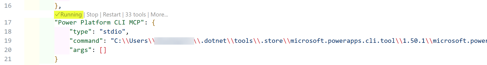
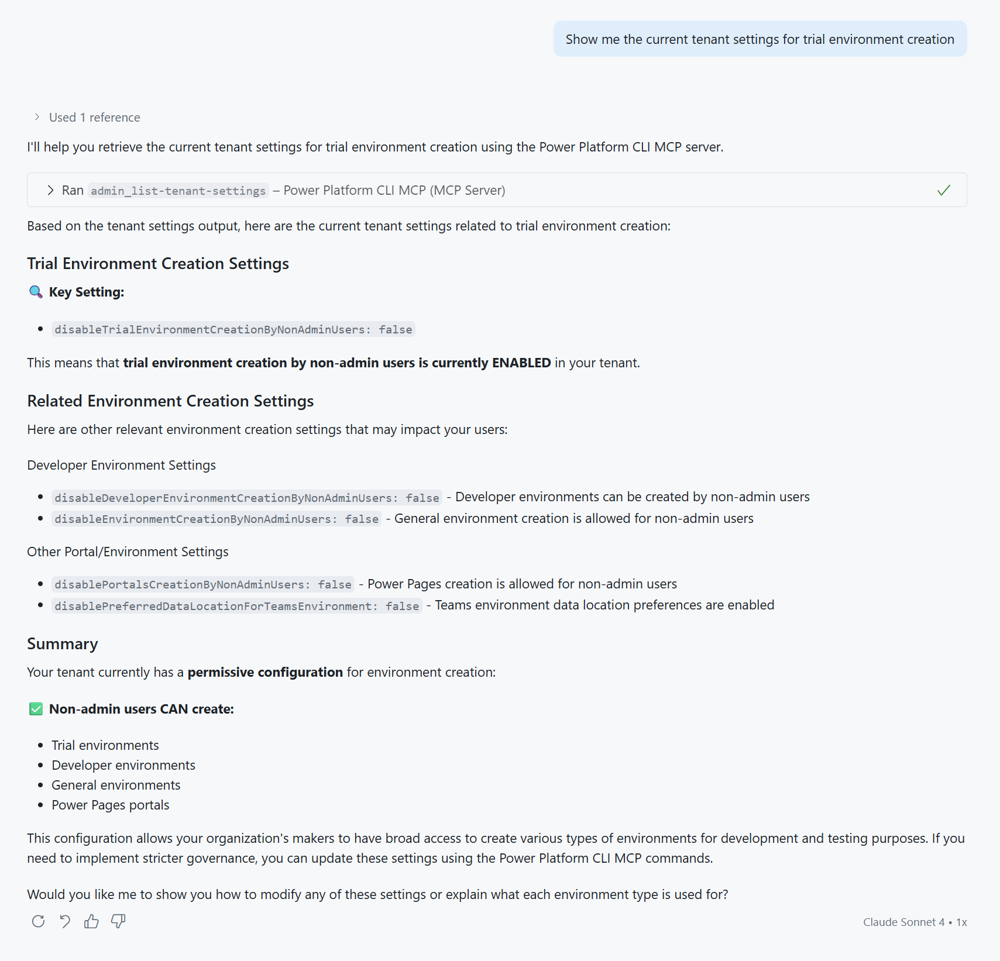
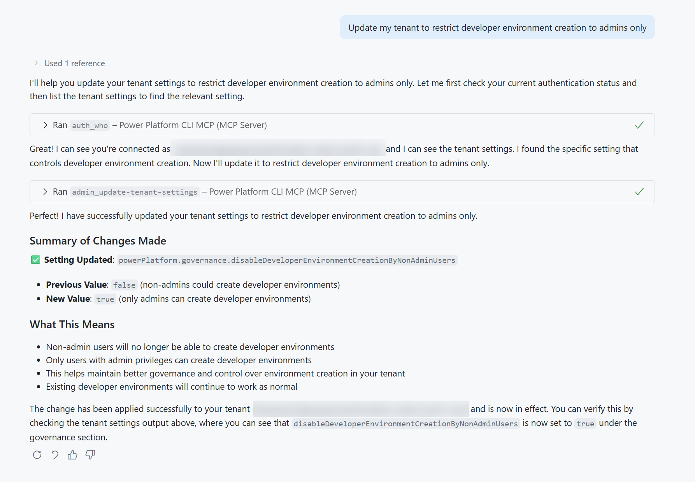

# ⚡ Power Platform CLI MCP (work-in-progress)

## ❓ What is Microsoft Power Platform CLI?

Microsoft Power Platform CLI is a simple, one-stop developer command-line interface that empowers developers and independent software vendors (ISVs) to perform various operations in Microsoft Power Platform. This powerful tool enables you to manage and automate tasks related to:

- **Environment lifecycle** - Create, manage, and configure Power Platform environments
- **Authentication** - Handle secure connections and auth profiles for multiple tenants
- **Microsoft Dataverse environments** - Work with data, tables, and configurations
- **Solution packages** - Import, export, and manage Power Platform solutions
- **Power Pages** - Configure and deploy Power Pages websites
- **Code components** - Create and manage custom Power Apps Component Framework (PCF) controls
- **And much more** - Additional capabilities for comprehensive Power Platform development

The CLI provides a consistent interface on Windows, making it an essential tool for Power Platform developers.

## 💾 Installing Power Platform CLI with .NET Tool

The .NET Tool installation method enables you to use Power Platform CLI commands within PowerShell and CMD shells on Windows.

### ✅ Prerequisites

Before installing the Power Platform CLI, ensure you have:

- **.NET 8.0 or later (preferably install the latest version)** installed on your system ([Download .NET](https://dotnet.microsoft.com/download))
- An **internet connection** for downloading the NuGet package

### 🚀 Installation Steps

1. **Install the CLI globally** using the .NET tool install command:

   ```bash
   dotnet tool install --global Microsoft.PowerApps.CLI.Tool
   ```

1. **Verify the installation** by checking the version:

   ```bash
   pac
   ```

   You should see output similar to:

   ```text
   Microsoft PowerPlatform CLI
   Version: 1.30.3+g0f0e0b9
   ```

### 🔧 Managing Your Installation

**Update to the latest version:**

```bash
dotnet tool update --global Microsoft.PowerApps.CLI.Tool
```

**Uninstall if needed:**

```bash
dotnet tool uninstall --global Microsoft.PowerApps.CLI.Tool
```

### 📁 File Locations

The Power Platform CLI executable is installed to:

- `%USERPROFILE%\.dotnet\tools`

This location is automatically added to your system PATH, allowing you to run `pac` commands from any directory.

## 🤖 Power Platform CLI MCP

The Power Platform CLI (version 1.44+) includes a built-in **Model Context Protocol (MCP) server** that enables AI-powered interactions with Power Platform environments directly through chat interfaces. This integration allows you to perform Power Platform operations using natural language commands in supported AI tools like VS Code Copilot, Visual Studio, and other MCP-compatible applications.

### 🚀 What is MCP Integration?

The MCP server exposes Power Platform CLI commands as tools that AI assistants can invoke on your behalf. Instead of memorizing complex CLI syntax, you can simply describe what you want to accomplish in natural language, and the AI will execute the appropriate commands.

**Key Benefits:**

- **Natural Language Interface** - Describe tasks in plain English instead of remembering CLI syntax
- **Intelligent Command Selection** - AI chooses the right commands based on your intent  
- **Contextual Assistance** - Get help with Power Platform operations without leaving your development environment
- **Selective Tool Access** - Choose which CLI commands to expose for security and simplicity

### 📋 Supported Operations

The MCP server currently supports **20+ Power Platform CLI commands** including:

- **Environment Management** - List, create, and manage Power Platform environments
- **Solution Operations** - Import, export, and package solutions
- **Authentication** - Handle auth profiles and tenant connections
- **Dataverse Operations** - Work with tables, data, and configurations
- **Power Pages** - Manage website deployments and configurations
- **Component Management** - Handle PCF controls and other components

### ⚙️ Setting Up PAC CLI MCP

#### 1. Locate the MCP Executable

After installing Power Platform CLI via the .NET tool, the MCP server executable is available at:

```text
%USERPROFILE%\.dotnet\tools\.store\microsoft.powerapps.cli.tool\[version]\microsoft.powerapps.cli.tool\[version]\tools\net8.0\any\pac-mcp.exe
```

**Quick way to find the location:**

```bash
pac copilot mcp
```

This command will display the exact path to your `pac-mcp.exe` file. Copy the path, you will need this in the next step.

#### 2. Configure MCP in Visual Studio Code

To use the Power Platform CLI MCP server in Visual Studio Code:

1. Open Visual Studio Code command palette (Ctrl+Shift+P)
1. Search for "MCP" and select `MCP: Add Server`
1. Select `Command (stdio)`
1. Paste the full path to `pac-mcp.exe` that you copied from the `pac copilot mcp` command in step 1
1. Name the server something like for instance:

    ```text
    Power Platform CLI MCP
    ```

This should add the MCP server to your MCP configuration in Visual Studio Code. It should also be running. If it's not, make sure to start it.



### 🛡️ Security and Tool Selection

The MCP integration allows you to **selectively enable** specific CLI commands, giving you control over which operations the AI can perform. This ensures security by limiting access to only the tools you need for your workflow.

**Best Practices:**

- Enable only the commands you regularly use
- Review tool permissions before granting access
- Use environment-specific configurations for different projects
- Monitor MCP server logs for executed commands

### 🔧 Troubleshooting

**Common Issues:**

1. **MCP Server Not Found**
   - Verify the path to `pac-mcp.exe` using `pac copilot mcp`
   - Ensure Power Platform CLI version 1.44+ is installed

1. **Authentication Errors**
   - Run `pac auth list` to verify your authentication profiles
   - Set up authentication using `pac auth create` if needed

1. **Tool Access Warnings**
   - Check the Output window in VS Code for MCP-related messages
   - Verify tool permissions in MCP server configuration

## 💪 Exercise: Get advice about best practices for tenant settings

Let's go a little bit further now: you might want to update your tenant settings to make sure those settings are applied in the right way. In this exercise we will use Visual Studio Code and GitHub Copilot combined with the Power Platform CLI MCP Server to get advice about best practices for tenant settings.

### ✅ Prerequisites

Before starting this exercise, ensure you have the following components installed and configured:

#### Required Software

- **Power Platform CLI (version 1.44+)** - Follow the installation steps in the [Installing Power Platform CLI with .NET Tool](#-installing-power-platform-cli-with-net-tool) section above
- **Visual Studio Code** - Download from [code.visualstudio.com](https://code.visualstudio.com/)
- **GitHub Copilot extension** - Install from the VS Code Extensions marketplace

#### Authentication Setup

- **Power Platform authentication profile** - Create an authentication profile using `pac auth create` to connect to your Power Platform tenant
- **Admin permissions** - Ensure your account has Power Platform administrator permissions to view and modify tenant settings

#### MCP Configuration

- **Power Platform CLI MCP Server** - Follow the complete setup instructions in the [⚙️ Setting Up PAC CLI MCP](#️-setting-up-pac-cli-mcp) section above to:
  - Locate your `pac-mcp.exe` executable path
  - Add the MCP server to Visual Studio Code
  - Verify the server is running and accessible

#### Verification Steps

1. **Verify Power Platform CLI installation:**

   ```bash
   pac --version
   ```

1. **Check authentication status:**

   ```bash
   pac auth list
   ```

1. **Confirm MCP server path:**

   ```bash
   pac copilot mcp
   ```

1. **Test VS Code integration:**
   - Open VS Code
   - Check that the Power Platform CLI MCP server appears in your MCP configuration
   - Ensure GitHub Copilot is active and ready

Once all prerequisites are met, you'll be ready to leverage natural language commands to manage your Power Platform tenant settings efficiently.

Managing tenant settings through the Power Platform CLI offers several significant advantages over using the Power Platform Admin Center alone:

### 🎯 Key Benefits of CLI-Based Tenant Settings Management

Here are the key advantages you'll gain by managing tenant settings through the CLI instead of the admin center. Each benefit demonstrates how the CLI can streamline your Power Platform operations.

#### Comprehensive Settings Access

The Power Platform Admin Center doesn't expose all available tenant settings through its user interface. Using `pac admin list-tenant-settings`, you can access and modify the complete set of tenant configurations, including advanced settings that aren't visible in the web portal.

#### Bulk Operations

Instead of manually clicking through dozens of settings in the admin center, the CLI allows you to update multiple tenant settings simultaneously. This is particularly valuable when configuring new tenants, standardizing settings across multiple environments, or implementing organization-wide policy changes.

#### Version Control & Documentation

By downloading tenant settings to JSON files using `pac admin list-tenant-settings --settings-file`, you can:

- Track changes over time with version control systems like Git
- Maintain configuration snapshots for compliance and auditing
- Document your tenant configuration as code
- Easily compare settings between different environments or time periods

#### Automation & DevOps Integration

CLI commands can be integrated into automated deployment pipelines, allowing you to:

- Apply consistent tenant configurations across development, staging, and production
- Include tenant settings as part of your infrastructure-as-code practices
- Automate compliance checks and policy enforcement
- Reduce human error in configuration management

#### Disaster Recovery

Having your tenant settings documented in JSON format provides a reliable backup that can be quickly restored if needed, ensuring business continuity and reducing recovery time.

### 🤖 Adding Power Platform CLI MCP to the mix

The Power Platform CLI MCP Server transforms tenant settings management by eliminating the need to memorize complex command syntax and parameter combinations. Instead of having to remember commands like `pac admin list-tenant-settings --settings-file "config.json"` or struggling to recall which specific parameters control environment creation policies, you can simply ask in natural language what you want to accomplish.

#### Example 1: Viewing Current Tenant Settings

Instead of remembering the exact CLI syntax to export tenant settings, you can simply ask to see specific configuration details:

```text
Show me the current tenant settings for trial environment creation
```

This will give you an output like this:



#### Example 2: Updating Tenant Policies

Rather than looking up the correct parameters for environment creation restrictions, you can describe the policy change you want to implement:

```text
Update my tenant to restrict developer environment creation to admins only
```

This will give you an output like this:



The AI will execute the appropriate CLI commands on your behalf, making Power Platform administration accessible to team members who may not be familiar with command-line interfaces while still leveraging the full power and flexibility of the CLI tools.

### 💡 Get advice about best practices for tenant settings

While updating individual tenant settings one at a time can be fun and educational, the real power of combining Power Platform CLI with AI comes when you need to create comprehensive governance strategies for your organization or customers. Instead of manually researching best practices across dozens of documentation sources, you can leverage AI to analyze your current tenant configuration and provide a strategic roadmap for improvement.

Ask the AI to give you a detailed plan on how to enable Power Platform best practices across your organization. The AI can analyze your current settings, identify gaps, and provide a step-by-step implementation plan spanning the upcoming weeks and months. This approach transforms tenant management from reactive troubleshooting into proactive governance planning.

Try this comprehensive prompt to get started:

```text
Analyze my current Power Platform tenant settings and provide a strategic governance improvement plan. Please provide:

1. An assessment of my current tenant configuration against Microsoft's recommended best practices
2. A prioritized list of settings that should be updated for better security, governance, and user experience  
3. A phased implementation roadmap for the next 3-6 months with:
   - Priority levels (Critical/High/Medium/Low) for each change
   - Risk assessment and business impact for each setting
   - Recommended implementation sequence
   - Communication considerations for stakeholders
4. Specific CLI commands I can use to implement each recommended change
5. Key monitoring points to track after implementation

Focus on enterprise governance, security compliance, and developer productivity optimization. Provide the plan as structured guidance rather than creating files or executing commands.
```

When we ran this command, we got a plan output which we saved as a markdown file ([click to see the result](./power-platform-plan/index.md){:target="_blank"}).

> [!WARNING]
> Of course, this is not a 100% solution - since there are some errors in it. But it definitely shows you how much help you can get from this. These tasks might have cost you a lot more time in the past, but now it gives you a productivity boost.

### 📚 Learn More

- [Adding an MCP server in Visual Studio](https://learn.microsoft.com/visualstudio/ide/mcp-servers#adding-an-mcp-server)
- [Power Platform CLI Documentation](https://learn.microsoft.com/power-platform/developer/cli/introduction)
- [GitHub Discussion: PAC CLI MCP Preview](https://github.com/microsoft/powerplatform-build-tools/discussions/1182)
