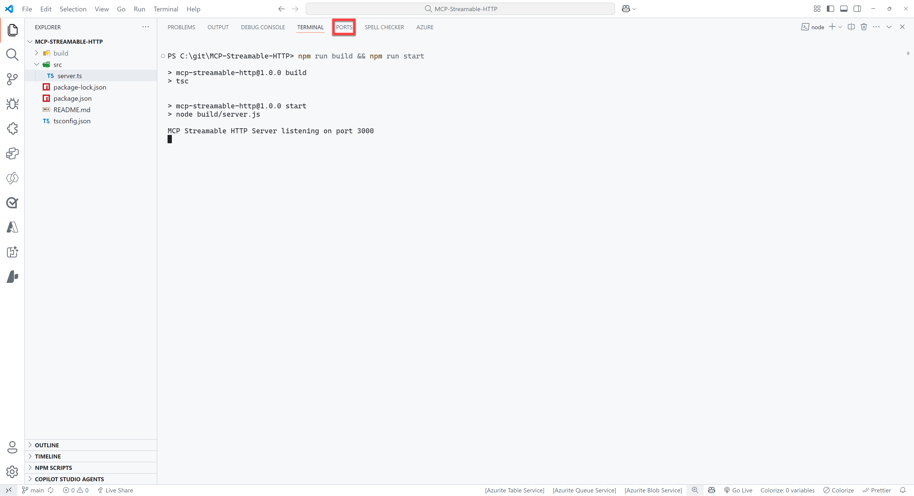
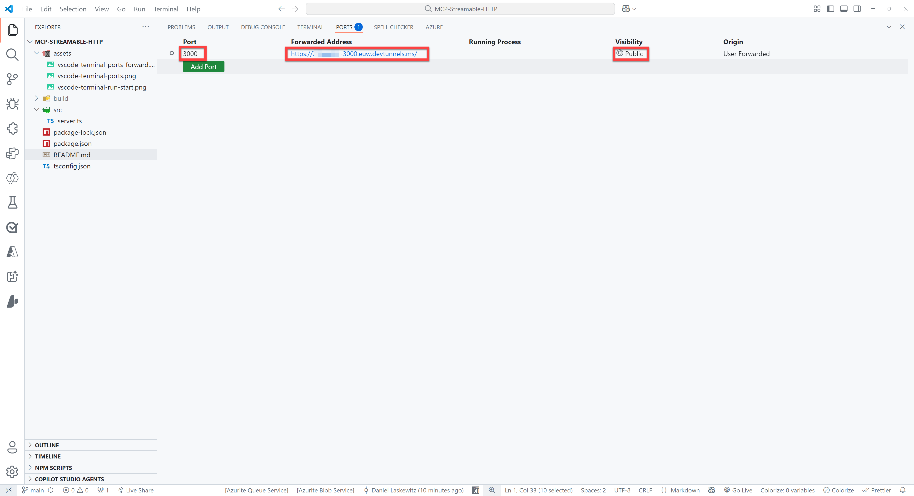
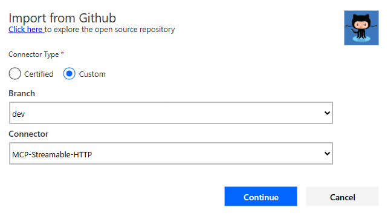

# 🌳🌲Parks Server Sample

Welcome to the **Parks Server Sample**. In this sample, you will learn how to run the MCP Server locally, and then add it to Microsoft Copilot Studio.
This sample exposes the [NPS APIs](https://www.nps.gov/subjects/developer/api-documentation.htm) as MCP tools and it's used to demonstrate how you can setup an MCP server that connects to an API which requires authentication using the API key method.


## The MCP server
The MCP server uses the HTTP Streaming transport protocol to expose the following capabilities:

- `getParks` | Get the list of the national US parks given a specific state
- `getActivities` | Get the list of activities available in US parks

## ⚙️ Prerequisites

- Visual Studio Code ([link](https://code.visualstudio.com/download))
- Node v22 (ideally installed via [nvm for Windows](https://github.com/coreybutler/nvm-windows))
- GitHub account

## 🚀 Minimal path to awesome

1. Open Visual Studio Code on the subfolder `samples/parks-http-typescript`
1. Open the terminal and navigate to the same folder
1. Run `npm run start`

    

1. Select `PORTS` at the top of the Visual Studio Code Terminal

    

1. Select the green `Forward a Port` button

    

1. Enter `3000` as the port number (this should be the same as the port number you see when you ran the command in step 5). You might be prompted to sign in to GitHub, if so please do this, since this is required to use the port forwarding feature.
1. Right click on the row you just added and select `Port visibility` > `Public` to make the server publicly available
1. Ctrl + click on the `Forwarded address`, which should be something like: `https://something-3000.something.devtunnels.ms`
1. Select `Copy` on the following pop-up to copy the URL

     

1.  Open to the browser of your choice and paste the URL in the address bar, type `/mcp` behind it and hit enter

If all went well, you will see the following error message:

```json
{"jsonrpc":"2.0","error":{"code":-32000,"message":"Method not allowed."},"id":null}
```

Don't worry - this error message is nothing to be worried about!

## 👨‍💻 Use the Parks MCP Server in Microsoft Copilot Studio

1. Go to https://make.preview.powerapps.com/customconnectors (make sure you’re in the correct environment) and click + New custom connector. 
1. Select `Import from GitHub`
1. Select `Custom` as **Connector Type**
1. Select `dev` as the **Branch**
1. Select `MCP-Streamable-HTTP` as the **Connector**
1. Select `Continue`

    

1. Change the **Connector Name** to something appropriate, like for instance `Events MCP` 
1. Change the **Description** to something appropriate
1. Paste your root URL (for instance `something-3000.something.devtunnels.ms`) in the **Host** field 
1. Move to the **Security** tab and select `API Key` as the **Authentication Type**
1. Provide the following values for the configuration:
   - **Parameter label**: API key
   - **Parameter name**: x-api-key
   - **Parameter location**: Header 
1. Select **Create connector** 

    You may see a warning and an error upon creation – it should be resolved soon - but you can ignore it for now.

1. Close the connector
1. Go to https://copilotstudio.preview.microsoft.com/  
1. Create your agent 
1. Select **Tools** > **Add a tool** > **Model Context Protocol** > And then select the MCP server you’ve just created
1. You will be asked to provide the API key, which you can get for free from the [NPS API documentation page](https://www.nps.gov/subjects/developer/get-started.htm). 

